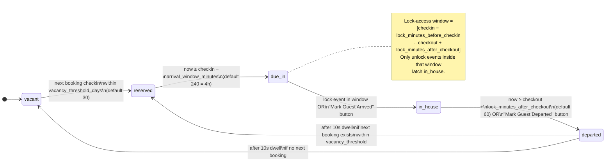
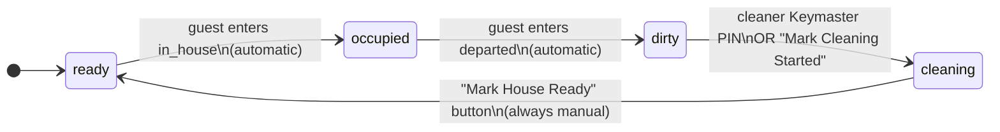

# 🏡 STR Concierge for Home Assistant

[![HACS Custom][hacs-badge]][hacs-url]
[![GitHub release][release-badge]][release-url]
[![License: MIT][license-badge]][license-url]

**Your smart home, but it actually knows when guests arrive.**

STR Concierge connects your short-term rental's booking calendar to Home Assistant. When a guest unlocks the door, your home knows it. When they check out, the lock relocks, lights go off, the thermostat goes to away mode, and your cleaner gets a notification — all automatically.

No more programming door codes by hand. No more forgetting to reset the thermostat between guests. No more wondering if the cleaner has finished.

---

## What it does

```
        Booking syncs from           Guest unlocks
        your PMS                     the door
                │                              │
                ▼                              ▼
        ┌────────────────────────────────────────────┐
        │             STR Concierge                  │
        │                                            │
        │   Knows who's coming, when,                │
        │   whether they're inside,                  │
        │   and whether the house is clean.          │
        └────────────────────────────────────────────┘
                            │
                            ▼
                  Your automations run
            (lights · climate · locks · notifications)
```

Out of the box you get:

- **A "Guest Status" sensor** — `reserved` (booked, not here yet) → `due_in` (arriving soon) → `in_house` (currently here) → `departed` (just checked out) → `vacant` (no booking within the next *N* days — *N* is configurable, default 30). As soon as a guest goes `departed`, the next booking inside the threshold shows up so you always know who's coming.
- **A "House State" sensor** — `ready` for the next guest, `occupied`, `dirty` (needs cleaning), `cleaning` (cleaner is on it)
- **Current guest info** — name, check-in / check-out times, door code, calculated lock-access window
- **Buttons for the cleaner** — "Mark Cleaning Started" and "Mark House Ready" go right on a dashboard or HA mobile app
- **Reliable automation triggers** — the `departed` state is held for a deterministic window so auto-lock and away-mode automations fire every time

---

## Which property management systems work?

| Provider | Status |
|---|---|
| [Host Tools](https://hosttools.com) | ✅ Supported & tested against the live API |
| [Hostfully](https://hostfully.com) | ⚠️ Implemented but **not verified against a live account** — use at your own risk |
| [Guesty](https://guesty.com) | ⚠️ Implemented but **not verified against a live account** — use at your own risk |
| Your own booking backend | ✅ via Custom Endpoint — full API spec in [docs/providers/backend-api-spec.md](docs/providers/backend-api-spec.md) |
| Lodgify, Smoobu, OwnerRez, Hospitable, Beds24, …? | Not yet — [community help wanted](CONTRIBUTING.md) |

The Hostfully and Guesty providers were written from the public API docs and pass the unit tests, but nobody has put them in front of a real account yet. If you try one and it works (or doesn't), please [open an issue](https://github.com/chschafl/ha-str-concierge/issues) — first-hand reports are the fastest way to get them promoted to "tested".

If your PMS isn't listed and you'd like to use STR Concierge, the integration is designed so that adding a new backend is a short, self-contained task. See [CONTRIBUTING.md](CONTRIBUTING.md) — even if you don't write the code yourself, opening an issue with details about your PMS's API is a great start.

---

## Installation

### Via HACS (recommended)

1. Open HACS → **Integrations** → ⋮ menu → **Custom repositories**
2. Add the URL `https://github.com/chschafl/ha-str-concierge` and select type **Integration**
3. Find **STR Concierge** in the HACS list and click **Download**
4. Restart Home Assistant
5. Go to **Settings → Devices & Services → Add Integration → STR Concierge**

### Manual

```bash
# From your HA config directory
git clone https://github.com/chschafl/ha-str-concierge.git /tmp/strc
cp -r /tmp/strc/custom_components/str_concierge config/custom_components/
# Then restart Home Assistant and add the integration from the UI.
```

---

## Setup walkthrough

The setup wizard takes about a minute.

### 1 · Choose your provider
Pick which PMS you use. If you run your own backend, choose **Custom Endpoint**.

### 2 · Enter credentials

| Provider | What to paste in |
|---|---|
| Host Tools | Your Host Tools API token (from **Settings → API** in Host Tools) |
| Hostfully | Your Hostfully API key |
| Guesty | `client_id:client_secret` joined with a colon (from the Guesty developer portal) |
| Custom Endpoint | Your token **and** your server's base URL |

The integration validates your credentials live — if it can't connect, you'll get a clear error before you continue.

### 3 · Pick the property
Choose which property this integration entry should track. (One property per entry — if you have multiple listings, add another integration entry per listing.) Set how often to check for booking updates (default: 5 minutes).

### 4 · Configure the door-lock trigger

Open the integration's **Configure** panel any time after setup:

| Option | What it does |
|---|---|
| **Arrival window** (minutes, default: 240) | How long before check-in time the guest status flips from `reserved` to `due_in` |
| **Vacancy threshold** (days, default: 30) | The next booking only shows up once it's within this many days. Anything further out leaves the integration in `vacant`. Also sets how far the provider fetches |
| **Lock minutes before check-in** (default: 0) | How early the door code becomes valid |
| **Lock minutes after check-out** (default: 60) | Courtesy window after checkout before the guest goes `departed` |
| **Lock trigger source** (default: **Disabled**) | How STR Concierge detects "guest just entered". **Disabled** (default) means rely on the manual buttons only. Pick **Lock entity** to listen to any HA lock or door sensor, or **Keymaster slot event** if you're using Keymaster |
| **Lock entity ID** | When trigger source is **Lock entity** — e.g. `lock.front_door` or `binary_sensor.front_door_unlocked` |
| **Unlock states** | Which states of that entity count as "unlocked" (default: `unlocked`). Comma-separated |
| **Keymaster slot name (guest arrival)** | When trigger source is **Keymaster slot event** — the slot name dedicated to the guest (e.g. `str_guest`) |
| **Keymaster slot name (cleaner arrival)** | Optional, independent of the guest setting. When the cleaner enters this slot's PIN and the house is `dirty`, it auto-flips to `cleaning`. Leave blank to handle "cleaning started" via the manual button only |

---

## What you get in Home Assistant

The integration creates a single **device** per property, with these entities grouped under it:

### Sensors

| Entity | What you see |
|---|---|
| **Guest** | `Alice Smith` (the current booking's guest name) |
| **Guest Status** | `reserved` / `due_in` / `in_house` / `departed` / `vacant` |
| **House State** | `ready` / `occupied` / `dirty` / `cleaning` |
| **Door Code** | `1234` — hidden by default; enable per-entity in **Settings → Devices & Services → STR Concierge → Door Code → ⚙** if you want to show it on a dashboard |
| **Check-in** | When the booking starts |
| **Check-out** | When the booking ends |
| **Lock Access Start** | check-in − "lock minutes before" |
| **Lock Access End** | check-out + "lock minutes after" |

### Binary sensors

| Entity | `on` when |
|---|---|
| **Guest Present** | Guest Status is `in_house` |
| **Lock Active** | `now` is inside the lock-access window (`Lock Access Start ≤ now ≤ Lock Access End`). Use this to gate when a door code / Z-Wave key slot should be enabled. `off` whenever the house is `vacant`. |

### Buttons

| Entity | What it does |
|---|---|
| **Mark Guest Arrived** | Manual override if the lock event was missed |
| **Mark Guest Departed** | Force the current guest to `departed` (auto-locks and notifies cleaner, same as a natural checkout) |
| **Mark Cleaning Started** | House `dirty` → `cleaning` |
| **Mark House Ready** | House `cleaning` → `ready` |

The cleaning buttons are designed to be put right on a dashboard or the HA mobile app — your cleaner can tap them on arrival and departure.

### What's automatic vs. what's manual

The integration is deliberately conservative about state transitions it can't be sure about. Here's what each state change requires:

| Transition | Trigger |
|---|---|
| `reserved` → `due_in` | Automatic (time-based, uses arrival window) |
| `due_in` → `in_house` | Door-lock event (if a trigger is configured) **or** **Mark Guest Arrived** button |
| `in_house` → `departed` | Automatic when `now ≥ checkout + courtesy window` **or** **Mark Guest Departed** button |
| `departed` → next guest / `vacant` | Automatic, 10 seconds after `departed`. Rotates to the next booking if one exists inside the vacancy threshold; else falls through to `vacant` |
| House `occupied` → `dirty` | Automatic, the moment the guest goes `departed` |
| House `dirty` → `cleaning` | Cleaner Keymaster slot PIN (if configured) **or** **Mark Cleaning Started** button |
| House `cleaning` → `ready` | **Mark House Ready** button — always manual |

In short: **departures and "cleaning finished"** are the two transitions that the integration won't decide on its own. You either hit the button, or you wire up an automation that does (a geofence on the cleaner's phone, an NFC tag in the property, an HA voice command — whatever fits your workflow).

### Lifecycle diagrams

Below: the state machines for the **guest status** and **house state** sensors, with the configuration knob that drives each transition labelled on the arrow. All the timing values are editable in **Settings → Devices & Services → STR Concierge → Configure**.

#### Guest status



#### House state

The house state is **independent** of the guest state, except for the two automatic crossings shown below. Cleaning workflow transitions are always driven by either the cleaner's Keymaster PIN or a manual button.



#### Config knobs at a glance

| Knob | Affects | Default |
|---|---|---|
| `vacancy_threshold_days` | `vacant ↔ reserved` cutoff. Also the provider's fetch window. | 30 |
| `arrival_window_minutes` | `reserved → due_in` trigger | 240 (4 hours) |
| `lock_minutes_before_checkin` | When the lock-access window opens (earlier = earlier `in_house` possible) | 0 |
| `lock_minutes_after_checkout` | When the lock-access window closes; also drives `in_house → departed` | 60 |
| `lock_trigger_source` | What counts as a lock-unlock event: `disabled` / `entity` / `keymaster` | `disabled` |
| `keymaster_slot` | Guest's Keymaster slot name (when `lock_trigger_source = keymaster`) | — |
| `cleaner_keymaster_slot` | Cleaner's Keymaster slot for `dirty → cleaning` (independent of `lock_trigger_source`) | — |

---

## Automations & integration samples

Ready-to-paste recipes — locking the house on departure, syncing PIN codes to Z-Wave or Keymaster, flipping the thermostat to home/away on guest status, resetting setpoints between bookings, and the full list of events you can hook into — live on their own page:

➡️ **[Automation recipes](docs/automation-recipes.md)**

---

## Contributing & developer docs

- **Adding a PMS provider, dev workflow, testing**: [CONTRIBUTING.md](CONTRIBUTING.md)
- **Per-provider implementation notes** (auth, endpoints, quirks): [docs/providers/](docs/providers/)

If your PMS isn't supported yet, the integration is structured to make adding new providers a clean, self-contained task — and we're keen to help. Open an issue or read CONTRIBUTING.md to get started.

---

## Roadmap

- [ ] Webhook receivers — replace polling for providers that push updates
- [ ] Lovelace card — pre-built dashboard for guest + house status at a glance
- [ ] Cleaner geofence auto-trigger (`cleaning` → `ready` when cleaner leaves the property)

---

## License

MIT © [chschafl](https://github.com/chschafl)

<!-- Badges -->
[hacs-badge]: https://img.shields.io/badge/HACS-Custom-orange.svg
[hacs-url]: https://github.com/hacs/integration
[release-badge]: https://img.shields.io/github/v/release/chschafl/ha-str-concierge
[release-url]: https://github.com/chschafl/ha-str-concierge/releases
[license-badge]: https://img.shields.io/badge/License-MIT-yellow.svg
[license-url]: LICENSE
